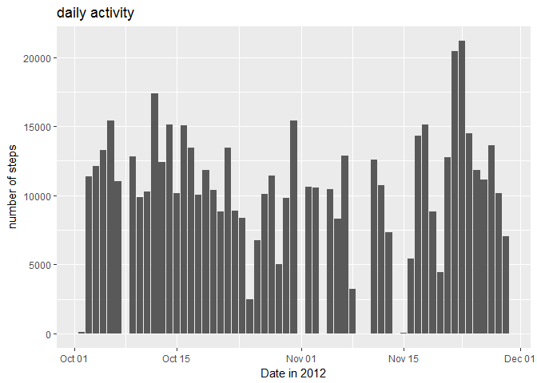
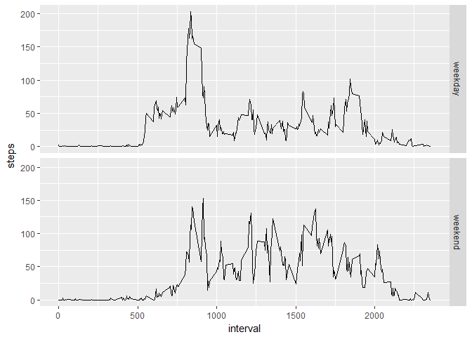

Activity assignment
================

1. Code for reading in the dataset and/or processing the data
-------------------------------------------------------------

``` r
# set working directory
  setwd(getwd())

# download data
  url <- "https://d396qusza40orc.cloudfront.net/repdata%2Fdata%2Factivity.zip"
  f <- file.path(getwd(),"activity.zip")
  download.file(url,f)
  unzip(zipfile="activity.zip",exdir=getwd())

# read data
  data <- read.csv("activity.csv")
```

2. Histogram of the total number of steps taken each day
--------------------------------------------------------

``` r
# calculate total number of steps per day
  sums <- aggregate(steps ~ date, data = data, sum)

# plot histogram
  library(ggplot2)
```

    ## Warning: package 'ggplot2' was built under R version 3.3.2

``` r
  ggplot(sums, aes(x=as.Date(sums$date),y=sums$steps)) +
    geom_histogram(binwidth = 0.5, stat="identity") +
    ggtitle("daily activity") + xlab("Date in 2012") + ylab("number of steps")
```

    ## Warning: Ignoring unknown parameters: binwidth, bins, pad



3. Mean and median number of steps taken each day
-------------------------------------------------

``` r
# calculate and report mean and median of number of steps per day
  stats <- c("mean" = mean(sums$steps), "median" = median(sums$steps))
```

4. Time series plot of the average number of steps taken
--------------------------------------------------------

``` r
# plot time series
  time_series <- aggregate(steps ~ interval, data = data, mean)
  ggplot(time_series, aes(interval, steps)) + geom_line()
```


5. The 5-minute interval that, on average, contains the maximum number of steps
-------------------------------------------------------------------------------

``` r
# max number of steps
  order <- time_series[order(time_series$steps),]
  tail(order,1)
```

    ##     interval    steps
    ## 104      835 206.1698

6. Code to describe and show a strategy for imputing missing data
-----------------------------------------------------------------

``` r
# calculate total number of na  
  na <- sum(is.na(data$steps))
  na
```

    ## [1] 2304

``` r
# fill in missing values & new dataset without NA  
  library(dplyr)
```

    ## Warning: package 'dplyr' was built under R version 3.3.2

    ## 
    ## Attaching package: 'dplyr'

    ## The following objects are masked from 'package:stats':
    ## 
    ##     filter, lag

    ## The following objects are masked from 'package:base':
    ## 
    ##     intersect, setdiff, setequal, union

``` r
# replacing NA with 0
  no_NA <- replace(data, is.na(data), 0)
  sums_NA <- aggregate(steps ~ date, data = no_NA, sum)
```

7. Histogram of the total number of steps taken each day after missing values are imputed
-----------------------------------------------------------------------------------------

``` r
# create histogram
  ggplot(sums_NA, aes(x=as.Date(sums_NA$date),y=sums_NA$steps)) +
    geom_histogram(binwidth = 0.5, stat="identity") +
    ggtitle("daily activity") + xlab("Date in 2012") + ylab("number of steps")
```

    ## Warning: Ignoring unknown parameters: binwidth, bins, pad


8. Panel plot comparing the average number of steps taken per 5-minute interval across weekdays and weekends
------------------------------------------------------------------------------------------------------------

``` r
#  calculate basic stats
  stats_NA <- c("mean" = mean(sums_NA$steps), "median" = median(sums_NA$steps))

# create weekday variable
  date_data <- transform(no_NA, date = as.Date(date))
  data_days <- mutate(date_data, weekdays = as.factor(weekdays(date_data$date)))
  library(plyr)
```

    ## -------------------------------------------------------------------------

    ## You have loaded plyr after dplyr - this is likely to cause problems.
    ## If you need functions from both plyr and dplyr, please load plyr first, then dplyr:
    ## library(plyr); library(dplyr)

    ## -------------------------------------------------------------------------

    ## 
    ## Attaching package: 'plyr'

    ## The following objects are masked from 'package:dplyr':
    ## 
    ##     arrange, count, desc, failwith, id, mutate, rename, summarise,
    ##     summarize

``` r
  data_week <- mutate(data_days, daylevel = revalue(data_days$weekdays, c("Saturday" = "weekend", "Sunday" = "weekend", "Monday" = "weekday","Tuesday" = "weekday","Wednesday" = "weekday","Thursday" = "weekday","Friday" = "weekday")))

# plot time series  
  time_series2 <- aggregate(steps ~ interval + daylevel, data = data_week, mean)
  ggplot(time_series2, aes(interval, steps)) + geom_line() + facet_grid(daylevel ~ .)
```


